

# **Proyecto Final - NutriDeliver**  
## **UNIVERSIDAD NACIONAL AUTÓNOMA DE MÉXICO**  
### **FACULTAD DE INGENIERÍA**  
#### **Temas selectos de ingeniería en computación II**

---

### **Integrantes**

 **Becerril Olivar Axel Daniel**  
 **Castañeda Mora Carlos**  
 **Cerón Maciel Eduardo Alfredo**  
 **Colin Mosqueda Eduardo**  
 **Dávila Reyes Ernesto Gabriel**  
 **Flores Pérez Milner Ushuaía**  
 **Guzmán Ramírez Aldo Yael**  
 **Quiñones Reyes Maximiliano**  
 **Resendiz Cruz Rodrigo Daniel**  
 **Valenzuela Vigil Ángel David**

DEMO AQUí: https://drive.google.com/file/d/1djd3O8AlKtBTECfWmRrFUuIu5EMH5F46/view

## **Cómo configurar y ejecutar este proyecto**

### ❖ **Instalar Node.js** *(ignorar si ya está instalado)*

1. Visite el sitio web oficial de Node.js:  
   [Node.js - Descargar](https://nodejs.org/en/download/)  
2. Descargue el programa de instalación.  
3. Inicie el instalador.  
4. Siga las indicaciones del instalador.  

  
**—Primero inicie el backend, luego el frontend y el administrador—**  

---

## ❖ **Instrucciones para establecer el backend del proyecto**

1. Acceda a la carpeta del proyecto en VS Code.  
2. Inicie la terminal integrada:  
   - **Clic derecho en la barra lateral > "Abrir en la terminal integrada".**  
3. Escriba `npm install` y presione Enter.  
   - **Instalación pendiente (requiere conexión a Internet).**

---

### 4. **Configuración de MongoDB**

#### a. Abra este vínculo: [Registro en MongoDB Atlas](https://www.mongodb.com/cloud/atlas/register)  
   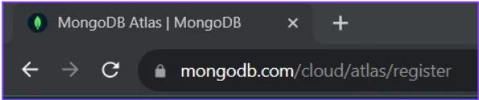  

#### b. Regístrese en el sitio web:  
     

#### c. Seleccione la opción "Nuevo proyecto":  
   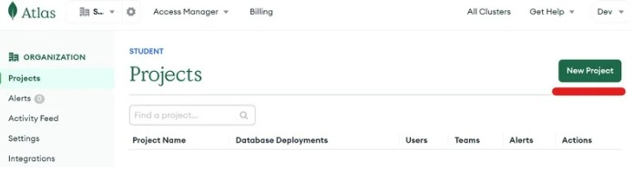  

#### d. Cree una base de datos en la sección correspondiente:  
   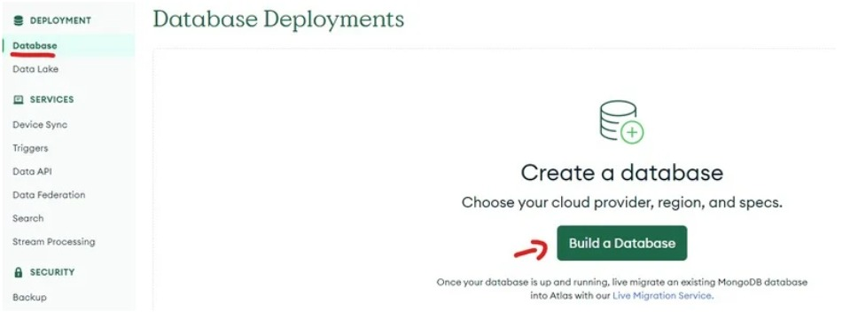  

#### e. Seleccione **M0** y configure su área para generar una base de datos:  
   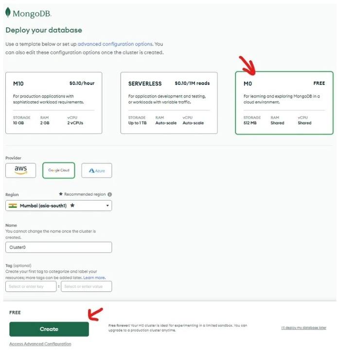  

#### f. Configure un nombre de usuario y contraseña:  
   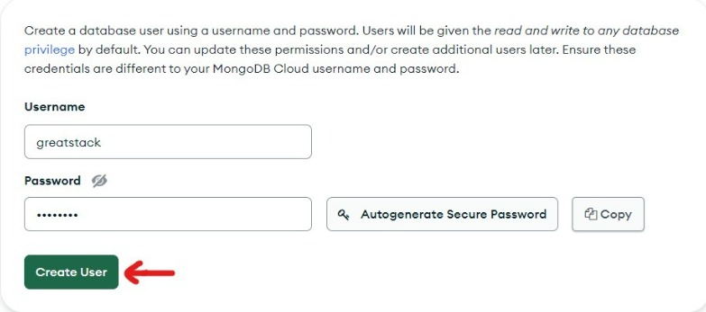  
   **Nota:** No emplee el símbolo `@` en la contraseña.

#### g. Finalice y cierre la configuración:  
     

#### h. Incluya la dirección IP `0.0.0.0` en la lista blanca y presione "Agregar entrada":  
   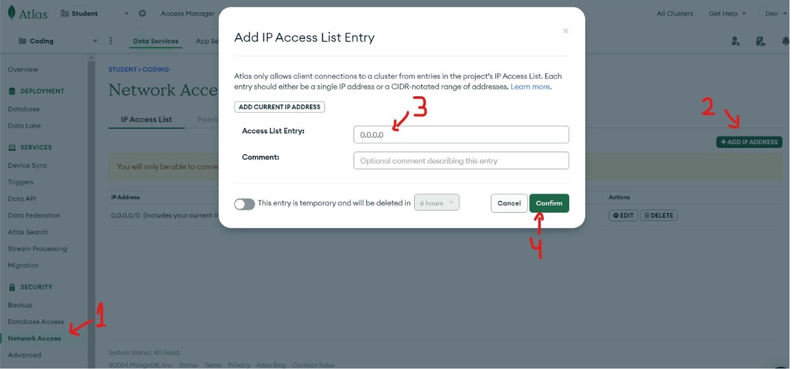  

#### i. Haga clic en "Conectar":  
   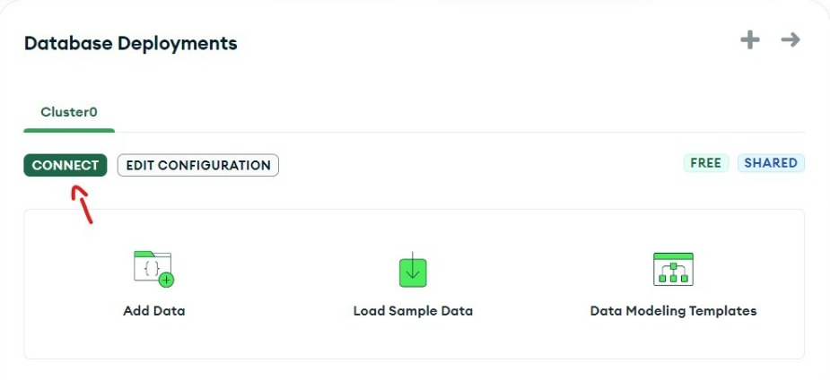  

#### j. Elija la opción "Compass" y copie la cadena de conexión:  
     
   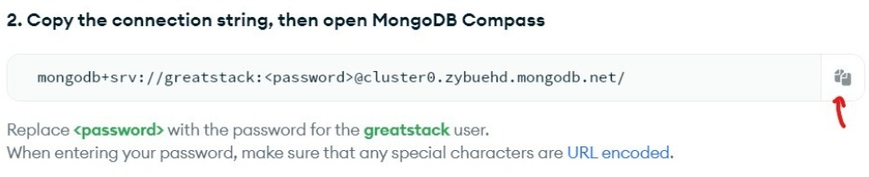  

#### k. Pegue la cadena en `db.js`, sustituyendo `contraseña` por la creada en 4.f:  
   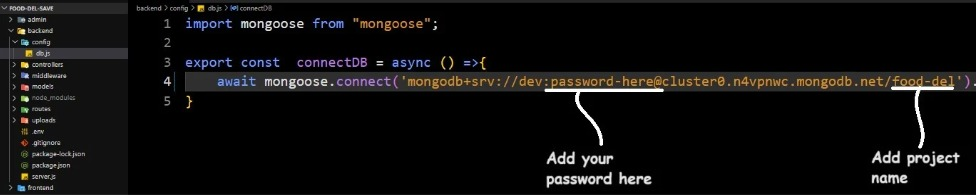  

---

### 5. **Configurar Stripe**

- Abra el archivo `.env` en la carpeta del backend.  
- Coloque su secreto de Stripe en la variable de entorno `CLAVE_SECRETA_STRIPE`.  
   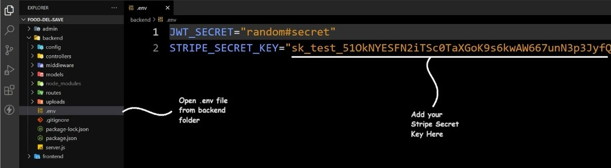  

---

### 6. **Iniciar el backend**

- Ejecute `npm run server` en la terminal integrada.  
   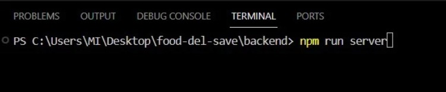  

---

## ❖ **Instrucciones para implementar el frontend y el panel de administración**

1. Acceda a la carpeta del proyecto en VS Code.  
2. Inicie la terminal integrada en el directorio del proyecto:  
   - **Clic derecho en la barra lateral > "Abrir en la terminal integrada".**  
   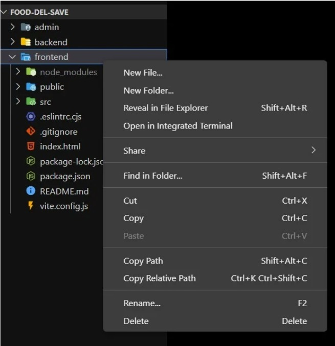  

3. Escriba `npm install` y presione Enter.  
   - **Instalación pendiente (requiere conexión a Internet).**  
   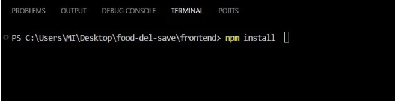  

4. Verifique que la carpeta `node_modules` esté creada.  
5. Ejecute `npm run dev` en la terminal.  
   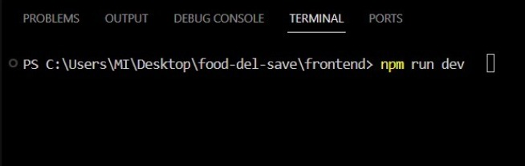  

6. El proyecto se abrirá automáticamente en su navegador web predeterminado.
